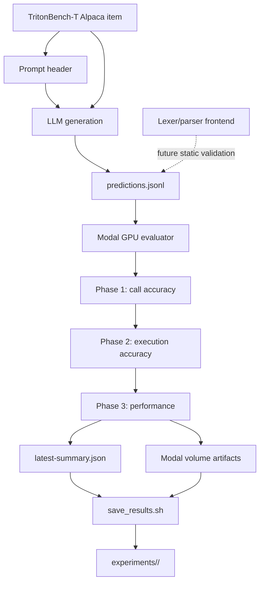

# TritonBench-T Methodology Report

Prepared: 2026-06-08

## Executive Summary

This project studies how to use large language models to generate Python-hosted Triton solutions for TritonBench-T, a benchmark of 166 PyTorch operator tasks. The work evolved from naive "write Triton kernels" prompting into a router-style generation methodology: first preserve PyTorch semantics, then classify the operator family, then choose between direct PyTorch, module-level `torch.compile`, or a narrow Triton fast path.

The central lesson is that Triton is not automatically faster than PyTorch. PyTorch CUDA, cuDNN, cuBLAS, cuSOLVER, and TorchInductor are already parallel and heavily optimized. Triton wins only when it has a concrete advantage: fewer kernel launches, less global-memory traffic, on-chip reuse, or a fused computation that PyTorch would otherwise execute as multiple kernels. For fragile library operations, direct PyTorch is often the best speed strategy because it preserves correctness and scores near 1.0 against a same-GPU PyTorch reference.

The current final prompt is `prompt-12-general-router.txt`. It encodes the learned skill as a compact compiler-style decision system rather than as a list of one-off task recipes. The supporting infrastructure runs generation and evaluation on Modal, archives artifacts, validates summary freshness, and now includes a Flex/Bison mini frontend that can scan and structurally parse generated Triton/Python code as a foundation for future static validation.

## Problem Statement

The project target is:

> Given an Alpaca-formatted TritonBench-T instruction describing a PyTorch operator or operator chain, generate a self-contained Python module that defines the exact wrapper function expected by the benchmark, optionally uses Triton or `torch.compile`, passes correctness tests, and improves runtime when possible.

The difficulty is not just writing Triton kernels. The benchmark stresses many operator families:

- simple elementwise operations
- fused elementwise chains
- reductions and normalization
- convolution, matmul, bmm, pooling, and linear layers
- dropout and stochastic behavior
- indexing and shape transforms
- linear algebra decompositions and solvers
- special functions such as Bessel, Airy, digamma, i0, erfc, and zeta
- factory, dtype, layout, quantization, optimizer, and autocast operations

Many of these are poor generic Triton targets. An LLM that tries to fuse everything tends to produce invalid APIs, incorrect signatures, wrong tensor shapes, broken optional-parameter handling, or kernels that are slower than PyTorch.

The practical objective became:

1. maximize call accuracy;
2. maximize execution accuracy;
3. pursue speed only when the route is technically justified;
4. measure speed using both official TritonBench golden timings and a fair same-GPU PyTorch reference.

## Background

### TritonBench-T

TritonBench-T is the PyTorch-to-Triton track of TritonBench. The benchmark provides natural-language tasks and reference tests. Each generated module is evaluated in three phases:

1. **Call accuracy:** the target wrapper exists, imports, and runs.
2. **Execution accuracy:** the generated output matches the PyTorch reference.
3. **Efficiency:** surviving operators are benchmarked and compared against PyTorch baselines.

The repo uses the `simp` Alpaca dataset by default, which contains 166 tasks.

### Triton Performance Model

Triton kernels are SPMD programs launched over a grid of programs. A typical kernel uses `tl.program_id`, `tl.arange`, masked `tl.load`, vectorized math, and `tl.store`. Triton is strong when the computation is simple enough to express explicitly and when the generated kernel avoids work PyTorch would do as separate launches or intermediate tensors.

Useful Triton patterns in this project:

- deterministic floating-point elementwise fusion
- same-shape tensor inputs plus scalar parameters
- output shape equal to the main input shape
- small row-wise reductions with clear axis semantics
- carefully bounded block sizes and masks

Poor generic Triton targets:

- standalone one-op elementwise functions such as `tanh`, `sigmoid`, `sqrt`, `add`, `div`
- convolution, matmul, bmm, and solvers unless the shape and algorithm are explicit
- special functions not supported by `triton.language`
- indexing, gather/scatter, shape-changing, random, dtype, factory, and quantization operations
- decompositions such as SVD, QR, LU, eigen, Cholesky, and least squares

The phrase "we can parallelize it" is true but insufficient. PyTorch already parallelizes these operators. The generated solution must either do less work or expose a better fused schedule.

## Experimental Setup

### Current Recorded Setup

| Category | Value |
| --- | --- |
| Benchmark | TritonBench-T, T track, `simp` Alpaca instruction tier |
| Benchmark size | 166 PyTorch operator/kernel-generation tasks |
| Generation task | Generate one self-contained Python module per benchmark instruction |
| Primary final prompt | `prompt-12-general-router.txt` |
| LLMs used in final batch | `claude-haiku-4-5`, `claude-sonnet-4-6` |
| Earlier local LLM | `qwen/qwen3.6-35b-a3b` through LM Studio native API |
| Hosted provider | Anthropic through `modal_app.py` |
| Local provider path | LM Studio through `modal_app_lmstudio.py` |
| Hardware tier | Modal single-GPU T4 tier |
| GPU | NVIDIA T4 |
| VRAM | 16 GB nominal T4 VRAM |
| GPU compute capability | 7.5 |
| Driver | Provided by Modal host; exact host driver version was not pinned in the repo artifacts |
| Container CUDA | CUDA 12.4.1 development image |
| Python | 3.12 inside Modal image |
| PyTorch | `torch==2.5.1` |
| Triton | `triton==3.1.0` |
| XGrammar | Not part of the primary Modal benchmark image; current grammar work uses a narrow XGrammar-style EBNF under `grammars/`, with package version not pinned in benchmark runs |
| Evaluation memory | `TRITONBENCH_EVAL_MEMORY_MB=131072` default container memory request |
| Dataset | `simp` unless explicitly stated otherwise |
| Max generation tokens | 16000 for final Claude batch |
| Generation concurrency | 1 for final Claude batch |
| Artifact volume | `tritonbench-t-data` |

### Timing And Reporting

The benchmark's performance phase reports per-operator timings through the upstream TritonBench performance harness. The recorded `ms` values are median-like benchmark outputs from the harness, and the project additionally computes:

- official speedup versus TritonBench's shipped upstream golden PyTorch timings;
- local same-GPU speedup versus PyTorch references remeasured on the same Modal T4.

The current archived experiments generally use one full generation/evaluation run per model/prompt configuration, not repeated independent full runs. Therefore:

| Field | Current status |
| --- | --- |
| Repetitions per generated operator | Internal benchmark repetitions are handled by the TritonBench/Triton timing harness; exact `k` is not surfaced in the archived summaries |
| Independent full-run repetitions | 1 per prompt/model run unless otherwise noted |
| Reported central tendency | Aggregate speedup plus per-op benchmark medians from the harness |
| IQR reporting | Not yet implemented in the archive summaries |
| Statistical test | Not yet applied to archived results |

For paper-style final reporting, the recommended standard is:

- run `k=5` independent full runs per prompt/model configuration;
- report per-operator speedup as median +/- IQR across independent runs;
- compare paired per-operator local same-GPU speedups with a two-sided Wilcoxon signed-rank test at `alpha=0.05`;
- use Holm-Bonferroni correction when comparing multiple prompts or models;
- keep official upstream-golden speed as a secondary benchmark-facing metric, and use local same-GPU speed as the main engineering metric.

## System Architecture



The architecture has two generation paths:

- `modal_app.py`: hosted provider generation and evaluation, currently supporting Anthropic and OpenAI.
- `modal_app_lmstudio.py`: local LM Studio generation through an OpenAI-compatible or native local API, followed by Modal GPU evaluation.

Both paths converge on the same JSONL prediction format and the same evaluator.

### Modal Runtime

The Modal image:

- uses CUDA 12.4.1 with Python 3.12;
- installs `torch==2.5.1`, `triton==3.1.0`, `anthropic`, and `openai`;
- clones upstream TritonBench;
- patches hardcoded benchmark paths and the hardcoded 8-GPU assumption;
- uses a single T4 GPU by default;
- stores results in the persistent volume `tritonbench-t-data`.

### Evaluation Artifacts

Each run writes artifacts under a Modal volume subdirectory such as:

```text
results/<run_id>/
+-- call_acc/
+-- perf_results/
+-- local_ref_ops/
+-- local_ref_results/
```

Then `save_results.sh` downloads those artifacts into `experiments/<run_id>/`. It now validates that `latest-summary.json` belongs to the expected `artifacts_subdir`, preventing stale-summary archives.

### Batch Runner

`run_prompt12_claude_full.sh` runs the final prompt against two hosted Claude models:

- `claude-haiku-4-5`
- `claude-sonnet-4-6`

It runs full `simp` evaluation with no `--limit`, saves each model separately, copies generated predictions from the Modal volume, writes metadata, and creates a combined summary.

## Generation Pipeline

The generation pipeline is:

1. Load an Alpaca task from TritonBench-T.
2. Combine the task with a prompt header such as `prompt-12-general-router.txt`.
3. Ask the LLM to output exactly one Python module inside one fenced code block.
4. Extract the Python code from the model response.
5. Write one JSONL record per task:

```json
{
  "instruction": "<exact Alpaca instruction>",
  "predict": "<generated Python module>"
}
```

6. Upload or write the JSONL into the Modal volume.
7. Run the evaluator.
8. Archive artifacts and summary metrics.

The expected generated module must:

- import the required libraries;
- define the exact public wrapper function;
- preserve the signature when possible;
- avoid tests and examples;
- include any helper or Triton kernels at module scope;
- use safe fallbacks for uncertain cases.

## The Prompt Skill

The prompt is treated as a "skill" built from repeated failures and measurement. It has several parts.

### 1. Output Contract

The model must output one self-contained Python module. It must not output prose, test code, multiple code blocks, placeholders, or missing wrappers.

The wrapper name is critical. Many failures came from wrong public names, especially dotted names such as `linalg.svd`. The final rule is:

- if the requested target is dotted, define the final component as the top-level function;
- `linalg.svd` becomes `def svd(...)`, not `def linalg_svd(...)`.

### 2. PyTorch Reference First

The prompt asks the model to mentally write the PyTorch reference path before optimizing. This prevents speed attempts from replacing the semantics.

The default fallback route is direct PyTorch, especially for fragile operator families.

### 3. Operator Router

The final prompt uses a route selector:

- **Route A: Direct PyTorch.** Use for fragile or already-optimized families.
- **Route B: Module-level `torch.compile`.** Use for stable structural chains with expensive ops plus deterministic tails.
- **Route C: Triton elementwise fusion.** Use only for clear deterministic CUDA floating-point elementwise chains.

### 4. Direct PyTorch Families

Direct PyTorch is required or preferred for:

- solvers and decompositions;
- special functions;
- convolution, matmul, bmm, pooling, and grid-sample unless a stable chain is present;
- random and factory ops;
- indexing and shape-changing ops;
- dtype/device/autocast/quantization/optimizer ops;
- bitwise, sign, comparison, masking, and data-dependent shape operations.

This rule sounds conservative, but it improved survival and preserved near-1.0 same-GPU speed for many tasks.

### 5. Module-Level `torch.compile`

`torch.compile` is allowed only when it is created once at module load:

```python
try:
    _name_fast = torch.compile(_name_impl, mode="max-autotune", fullgraph=False)
except Exception:
    _name_fast = _name_impl
```

It must never be called inside the public wrapper. One of the important speed failures came from hot-path compilation inside `fused_mv_logsoftmax_dropout`.

### 6. Triton Safety Rules

Triton is allowed only for narrow floating-point elementwise fusion:

- CUDA tensors;
- same-shape or scalar inputs;
- deterministic math;
- no reductions unless simple and explicit;
- no indexing, convolution, matmul, solver, random, or special function semantics;
- bounded block sizes;
- masked loads and stores;
- PyTorch fallback.

The prompt also bans repeated invalid APIs:

- `tl.tanh`
- `tl.erfc`
- `tl.signbit`
- `tl.pow`
- `tl.ones_like`
- `tl.math`
- `tl.libdevice`

Known workarounds are embedded directly, such as tanh via sigmoid and exact GELU via `tl.erf`.

### 7. Optional-Parameter And Shape Safety

A major late-stage lesson was that many failures were semantic rather than GPU-specific:

- optional tensors used without `None` checks;
- shape inferred from optional affine weights;
- `normalized_shape` passed as an int when PyTorch expected a tuple;
- fallback helpers sharing the same bug as compiled helpers.

Prompt 12 treats optional values as dangerous and requires shape inference from the computed tensor or explicit normalized-shape arguments.

### 8. Final Self-Check

The prompt closes with a self-check:

- exact top-level function exists;
- dotted names are handled correctly;
- signatures are not expanded with invented parameters;
- optional tensors are checked;
- special functions and solvers use PyTorch;
- `torch.compile` is module-level only;
- Triton is only used for clear elementwise fusion;
- no invalid Triton APIs appear.

## Iteration Methodology

The methodology was deliberately empirical:

1. Run a small smoke test, often `--limit 5`, to identify immediate correctness failures.
2. Run a broader `--limit 20` test to include more operator families and speed candidates.
3. Run the full 166-task set when the prompt looked stable.
4. Compare both official upstream-golden speed and local same-GPU speed.
5. Inspect failed generated files and logs.
6. Convert recurring failures into prompt rules.
7. Avoid overfitting single tasks unless a task exposed a general class of errors.

This produced a practical balance between prompt engineering and benchmark debugging. One repeated infrastructure lesson was that `latest-summary.json` can become stale if a run crashes before writing a new summary, so summary validation became part of the artifact pipeline.

## Prompt Iteration History

### Prompt 8: Safe PyTorch-First Prompt

Prompt 8 established the core performance model:

- Triton wins only through less memory traffic, fewer launches, or useful fusion.
- Standalone elementwise Triton is often slower than PyTorch.
- Structural ops should generally stay in PyTorch.

Observed result:

| Run | Tasks | Exec accuracy | Official speed | Local speed |
| --- | ---: | ---: | ---: | ---: |
| prompt-8 limit 5 | 5 | 100% | 0.32 | 0.99 |

The result was correct but not fast.

### Prompt 9: Speed-Seeking Prompt

Prompt 9 separated speed exploration from the safe prompt family. It introduced broader use of `torch.compile` for chains and Triton for pure elementwise fusion.

Observed results:

| Run | Tasks | Exec accuracy | Official speed | Local speed |
| --- | ---: | ---: | ---: | ---: |
| prompt-9-speed limit 20 | 20 | 85% | 0.29 | 1.22 |
| prompt-9-speed full 166 | 166 | 74.7% | 0.47 | 1.24 |

This proved that a local same-GPU speedup above 1.0 was possible. The weakness was survival: too many generated modules failed correctness.

### Prompt 9 Ultraspeed: Diagnostic Aggression

The ultraspeed variant sacrificed some caution to test whether speed was possible.

Observed result:

| Run | Tasks | Exec accuracy | Official speed | Local speed |
| --- | ---: | ---: | ---: | ---: |
| prompt-9-ultraspeed, Qwen coder limit 10 | 10 | 90% | 0.27 | 1.17 |

It confirmed that speed could be improved, but the official upstream-golden score remained poor and correctness risk remained high.

### Prompt 10: Selective Speed

Prompt 10 made the speed strategy more selective:

- local same-GPU speed became the main optimization target;
- fragile categories were direct PyTorch;
- `torch.compile` was restricted to stable structural chains;
- Triton was restricted to measured-good elementwise chains.

Observed result:

| Run | Tasks | Exec accuracy | Official speed | Local speed |
| --- | ---: | ---: | ---: | ---: |
| prompt-10 limit 20 | 20 | 90% | 0.39 | 1.36 |

This improved both correctness and local speed relative to prompt 9 on the same sample.

### Prompt 11: Explicit Router

Prompt 11 turned prompt 10 into a route selector and added targeted fixes:

- dotted target names;
- special functions as direct PyTorch;
- no hot-path compile;
- exact handling of known early tasks.

Observed results:

| Run | Tasks | Exec accuracy | Official speed | Local speed |
| --- | ---: | ---: | ---: | ---: |
| prompt-11 limit 20 | 20 | 95% | 0.43 | 1.40 |
| prompt-11 full 166 | 166 | 83.73% | 0.40 | 1.13 |

The full run showed a tradeoff: prompt 11 survived more tasks than prompt 9, but local speed dropped because many additional survivors were direct PyTorch or near-1.0 fallbacks.

### Prompt 12: General Router

Prompt 12 intentionally moved away from per-task recipes and encoded general principles:

- classify the operator family;
- write the PyTorch reference path first;
- apply optional-parameter and shape safety before optimizing;
- use module-level `torch.compile` only for stable structural chains;
- use Triton only for clear elementwise fusion.

Prompt 12 is the selected final prompt because it represents the desired methodology rather than a set of memorized benchmark recipes. One local Qwen prompt-12 smoke run exposed instability: it reached only 13/20 call accuracy and the phase-3 process repeatedly hit SIGKILL/OOM before a valid final summary. That result is useful as a warning: pure generalization can hurt weaker local models.

The completed Claude full batch is archived under `experiments/prompt12_claude_full_20260607-201510`.

| Run | Tasks | Exec accuracy | Official speed | Local speed |
| --- | ---: | ---: | ---: | ---: |
| prompt-12 Haiku 4.5 full 166 | 166 | 81.33% | 0.42 | 1.10 |
| prompt-12 Sonnet 4.6 full 166 | 166 | 95.78% | 0.40 | 1.23 |

This result supports the final-prompt decision: Sonnet 4.6 with prompt 12 achieved the best full-run survival observed so far while keeping local same-GPU speed above 1.0.

## Measurement Interpretation

Two speed metrics matter:

- **Official upstream-golden speed:** compares generated timings against golden PyTorch timings shipped with TritonBench.
- **Local same-GPU speed:** remeasures PyTorch references on the same Modal GPU and compares generated code against that local baseline.

The local metric is more diagnostic for prompt quality because it controls hardware. Early confusion came from interpreting official scores around 0.3 as absolute failure even when local runs were near or above 1.0. The official score is still useful for benchmark reporting, but local speed is better for engineering decisions.

Key reading:

- prompt 8 proved correctness;
- prompt 9 proved local speed above 1.0 was possible;
- prompt 10 and 11 improved the tradeoff;
- prompt 12 captured the general decision process as the final skill.

## Static Validation Frontend

A separate but related effort builds a small compiler frontend for generated Triton/Python code.

### Lexer

`lexer/triton_lexer.l` is a Flex scanner that tokenizes Python-hosted Triton modules. It emits:

- layout tokens: `NEWLINE`, `INDENT`, `DEDENT`;
- identifiers and literals;
- Python keywords, operators, delimiters, and decorators;
- dotted APIs as generic token sequences, such as `IDENTIFIER DOT IDENTIFIER`.

It handles:

- comments;
- triple-quoted strings;
- implicit continuation inside delimiters;
- explicit backslash-newline continuation;
- indentation stack management.

### Grammar And Parser

`grammar/triton_kernel_cfg.md` defines a starter context-free grammar for Python-hosted Triton syntax. `parser/triton_parser.y` implements the first executable structural parser.

The current parser checks:

- logical line structure;
- indentation blocks;
- colon block headers;
- balanced delimiters;
- crossed delimiters;
- unterminated string lexer errors;
- invalid indentation after non-block lines.

It does not yet enforce deep semantics, such as undefined variables, tensor shapes, legal Triton API calls, or decorator alias resolution.

### Validation Results

The parser validation report records:

| Area | Result |
| --- | --- |
| Token coverage contract | all 91 tokens mentioned in CFG and parser |
| Lexer scan | 1258 Python files, 558614 tokens, 0 lexer failures |
| Parser pass | 1258 Python files, 0 rejected files |
| Smoke tests | 5 valid accepted, 5 invalid rejected |
| Dedicated invalid Triton-shaped tests | 6 invalid snippets detected |

This frontend is not yet a full static validator, but it is a foundation for pre-evaluation checks. It can eventually catch generated-code issues before Modal spends GPU time on them.

## Current File Roles

| File or directory | Role |
| --- | --- |
| `modal_app.py` | Hosted provider generation plus Modal evaluation |
| `modal_app_lmstudio.py` | Local LM Studio generation plus Modal evaluation |
| `prompt-12-general-router.txt` | Final router prompt |
| `run_prompt12_claude_full.sh` | Full prompt-12 batch runner for Haiku 4.5 and Sonnet 4.6 |
| `save_results.sh` | Downloads artifacts and validates summary freshness |
| `experiments/` | Archived benchmark runs |
| `lexer/` | Flex scanner for generated Triton/Python code |
| `grammars/` | Narrow XGrammar-style EBNF for constrained elementwise generation |
| `grammar/` | Human-readable starter CFG and token coverage check |
| `parser/` | Bison parser, smoke tests, negative tests, experiment parser |
| `RUN.md` | Operational command history and run examples |

## Reproducible Commands

Run the final prompt against Claude Haiku 4.5 and Sonnet 4.6:

```bash
./run_prompt12_claude_full.sh
```

Optional stronger Anthropic settings:

```bash
ANTHROPIC_THINKING=adaptive ANTHROPIC_EFFORT=max ./run_prompt12_claude_full.sh
```

Run prompt 12 through local LM Studio:

```bash
RUN_ID=lmstudio_prompt12_general_router_full_$(date +%Y%m%d-%H%M%S)
modal run modal_app_lmstudio.py::main --model qwen/qwen3.6-35b-a3b --api native \
  --prompt-file prompt-12-general-router.txt --output-subdir results/${RUN_ID} \
  2>&1 | tee latest-run.log
bash save_results.sh results/${RUN_ID} experiments/${RUN_ID}
```

Run lexer/parser validation:

```bash
make -C lexer
python3 lexer/run_experiment_scan.py

make -C parser
python3 grammar/check_token_coverage.py
python3 parser/run_smoke_tests.py
python3 parser/run_negative_tests.py
python3 parser/run_experiment_parse.py
```

## Lessons Learned

1. Correctness is a performance feature. Broken kernels score zero, and many direct PyTorch fallbacks are already near 1.0 locally.
2. Triton should be selected, not forced. A useful prompt must say when not to use Triton.
3. Speedups come from reduced memory traffic, fewer launches, and fusion, not from the word "parallel."
4. The first five benchmark tasks are not representative of the full operator distribution.
5. `torch.compile` can help structural chains, but hot-path compilation is disastrous.
6. Optional tensors and shape inference are recurring failure sources.
7. Invalid Triton APIs are common enough to require an explicit ban list.
8. The official benchmark speed metric and local same-GPU speed metric tell different stories.
9. Stale summaries can corrupt experiment interpretation; artifact validation is necessary.
10. A lightweight static frontend can become a useful preflight layer for generated code.

## Limitations

- Prompt 12 has one archived full Claude Haiku/Sonnet batch, but not yet multiple independent repetitions with IQR and statistical testing.
- The current parser is structural, not semantic.
- The benchmark still depends on a single Modal GPU class by default, so results may shift with GPU type.
- The local LM Studio model behavior differs substantially from hosted Claude behavior.
- Some speed improvements may be hidden or distorted by upstream golden timing differences.

## Future Work

1. Repeat the prompt-12 Haiku/Sonnet comparison enough times for median +/- IQR reporting and paired statistical tests.
2. Add a static preflight validator before Modal evaluation:
   - missing public wrapper;
   - invalid Triton APIs;
   - `torch.compile` inside public wrappers;
   - obvious bad signatures;
   - optional tensor attribute access without `None` checks;
   - dangerous uncapped block sizes.
3. Extend the parser from structural syntax toward semantic Triton/PyTorch checks.
4. Compare prompt behavior across T4, L4, A10, and stronger GPUs.
5. Track per-operator families instead of only aggregate speed.
6. Separate prompt rules into a formal operator-family router that can be applied before LLM generation.

## Conclusion

The project moved from prompt trial-and-error toward a compiler-style generation methodology. The core skill is not "write Triton kernels." The skill is to decide, for each operator, which implementation route has the best chance of surviving the benchmark while preserving or improving speed.

Prompt 12 is the clearest expression of that skill:

- identify the exact public function;
- preserve PyTorch semantics first;
- classify the operator family;
- choose direct PyTorch, module-level `torch.compile`, or Triton fusion;
- enforce optional-shape and API safety;
- optimize only after correctness is secure.

This gives the project a reusable methodology, a reproducible pipeline, and a path toward automated validation rather than more one-off prompt patches.
