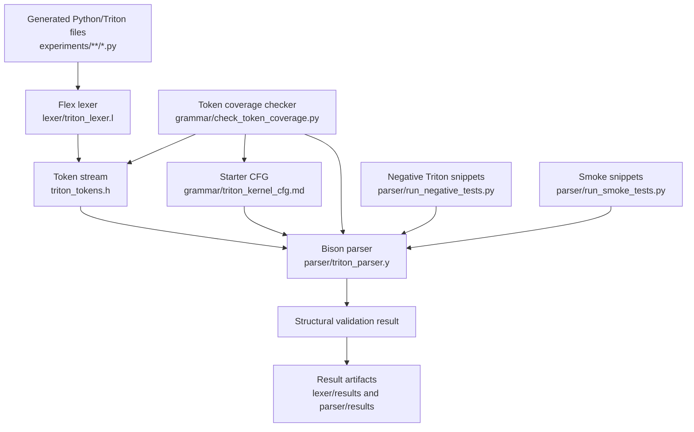
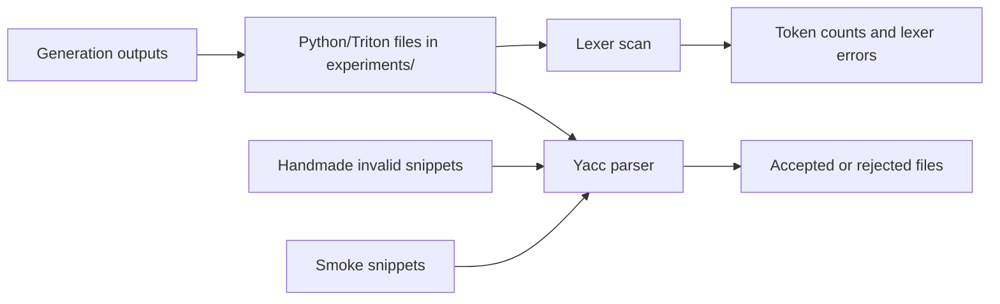

# Lex/Yacc Triton Frontend Report

This report documents the Lex/Yacc section of the TritonBench4Modal compiler
work. It focuses only on the lexical and syntactic mini frontend: why it exists,
how it is structured, how it was iterated, how it is tested, and how it supports
future correctness checks for generated Triton kernels.

## Scope

This report covers:

- the problem statement for the Triton lexer/parser frontend
- background on Python-hosted Triton code and why a staged compiler frontend is
  useful
- the generation and validation pipeline for generated kernels
- the architecture of the Lex/Yacc subsystem
- the lexer, token set, CFG, yacc parser, runners, and result folders
- the methodology used to evolve the frontend incrementally
- the current valid and invalid test results
- known limitations and next steps

This report does not cover benchmark performance, model prompting strategy,
Triton runtime execution, CUDA correctness, or numerical validation. Those are
outside the Lex/Yacc section.

## Problem Statement

Generated Triton kernels are Python files that mix ordinary Python structure
with Triton-specific constructs such as `@triton.jit`, `tl.load`, `tl.store`,
`tl.arange`, `tl.constexpr`, and kernel launch syntax like
`kernel[grid](...)`.

The problem is that generated code can be syntactically malformed before it even
reaches runtime. Examples include:

- missing `:` before an indented function or control-flow block
- malformed indentation or inconsistent dedents
- unclosed calls such as `tl.load(ptr + offsets`
- crossed delimiters such as `(...]`
- extra closing delimiters
- unterminated strings
- incorrect physical-line handling around Python continuations

The frontend is intended to catch these low-level correctness issues early. It
is also intended to become the base for later semantic checks, such as detecting
unknown variables, tracking imports and aliases, recognizing Triton kernels, and
validating common generated-kernel patterns.

The current design deliberately avoids trying to implement all of Python at
once. Instead, it builds an incremental compiler frontend that is simple,
general, and useful immediately.

## Background

Triton kernels are embedded in Python. A typical generated file may contain:

- imports such as `import triton` and `import triton.language as tl`
- decorators such as `@triton.jit`
- Python function definitions
- annotations such as `BLOCK_SIZE: tl.constexpr`
- assignments and expressions
- calls into Triton APIs
- calls into PyTorch for wrapper/test code
- control flow such as `if`, `for`, `while`, `try`, and `except`
- launch syntax such as `_kernel[grid](...)`

This means a useful frontend must recognize both Python structure and
Triton-relevant patterns. Hard-coding every Triton API as a unique token would
make the lexer brittle. Instead, the lexer treats dotted APIs generically:

```text
tl.load
```

is tokenized as:

```text
IDENTIFIER DOT IDENTIFIER
```

This leaves meaning to the parser and future semantic passes. The same token
shape works for `triton.jit`, `tl.store`, `torch.empty_like`,
`torch.nn.functional`, or an alias introduced by imports.

## Design Philosophy

The frontend was built around five principles.

### 1. General Before Specific

The lexer should not know every Triton function. It should know Python-like
syntax: identifiers, literals, keywords, operators, delimiters, indentation,
comments, and strings.

Triton meaning is deferred:

- lexer: identifies token shapes
- parser: validates structural syntax
- future semantic pass: decides whether `tl.load` is a legal Triton API use

### 2. Incremental Correctness

The first parser should not pretend to be a complete Python grammar. It should
catch a small set of high-value errors reliably. The current parser validates:

- logical lines
- final line with or without trailing newline
- indentation blocks
- block headers that must end with a top-level colon
- balanced `()`, `[]`, and `{}`
- lexer-origin errors

### 3. Token Coverage Discipline

Every token defined by the lexer must be mentioned in both:

- `grammar/triton_kernel_cfg.md`
- `parser/triton_parser.y`

This prevents the lexer and grammar from drifting apart. The checker script is:

```bash
python3 grammar/check_token_coverage.py
```

Current result:

```text
All 91 lexer tokens are mentioned in grammar/triton_kernel_cfg.md and parser/triton_parser.y.
```

### 4. Real Corpus Validation

The frontend is tested against real generated code under `experiments/`, not
only toy snippets. This ensures the token set and structural parser remain
compatible with the generated TritonBench code that already exists.

### 5. Negative Testing

The frontend is also tested against intentionally broken Triton-shaped code. The
goal is to prove it rejects what it claims to reject.

## System Architecture

The Lex/Yacc subsystem is organized as a small compiler frontend.



Main components:

| Component | Role |
| --- | --- |
| `lexer/triton_tokens.h` | Shared token definitions used by lexer and parser |
| `lexer/triton_lexer.l` | Flex scanner for Python-hosted Triton files |
| `lexer/Makefile` | Builds standalone lexer token-printer |
| `lexer/run_experiment_scan.py` | Scans `experiments/**/*.py` and writes lexer results |
| `grammar/triton_kernel_cfg.md` | Human-readable starter CFG and future grammar target |
| `grammar/check_token_coverage.py` | Ensures every lexer token is represented in CFG and yacc parser |
| `parser/triton_parser.y` | Bison parser for current structural validation |
| `parser/Makefile` | Builds parser and regenerates shared lexer C source |
| `parser/run_smoke_tests.py` | Fast valid/invalid parser smoke tests |
| `parser/run_experiment_parse.py` | Parses all generated experiment Python files |
| `parser/run_negative_tests.py` | Runs intentionally invalid Triton-shaped examples |
| `parser/validate_predictions.py` | Preflights local predictions JSONL before Modal upload |
| `parser/VALIDATION_REPORT.md` | Result-oriented validation report |

## Generation And Validation Pipeline

The frontend is used after Triton code has been generated into the repository's
experiment folders.



The pipeline has three practical modes.

### Mode 0. Pre-Modal Local Predictions Gate

Command:

```bash
python3 parser/validate_predictions.py local-predictions/run.jsonl
```

Purpose:

- extract each `predict` module from a local predictions JSONL
- run the standalone lexer and yacc parser before the JSONL is uploaded to Modal
- stop early if generated code has structural syntax problems
- save extracted modules, stderr diagnostics, accepted records, and failed
  records in a dedicated result folder

This gate is now wired into local upload paths:

- `modal_app_lmstudio.py::main` validates after local LM Studio generation and
  before upload
- `modal_app.py::evaluate_only` validates bring-your-own predictions before
  upload
- `modal_app.py::main --predictions ...` validates bring-your-own predictions
  before upload

The gate can be bypassed with `--skip-preflight` when the local Flex/Bison
toolchain is unavailable, but the normal pipeline should keep it enabled.

### Mode 1. Tokenization

Command:

```bash
make -C lexer
python3 lexer/run_experiment_scan.py
```

Purpose:

- verify that real generated files can be tokenized
- count token usage
- collect lexer `ERROR` tokens
- save representative token streams

Latest successful result:

```text
lexer/results/experiments_scan_20260608_221213
```

Summary:

| Metric | Value |
| --- | ---: |
| Python files scanned | 1258 |
| Total tokens emitted | 558614 |
| Files with lexer errors | 0 |
| Total `ERROR` tokens | 0 |

### Mode 2. Structural Parsing Of Generated Code

Command:

```bash
make -C parser
python3 parser/run_experiment_parse.py
```

Purpose:

- verify that the current parser accepts generated code that should be accepted
- catch structural issues before runtime
- write per-file parse status and diagnostics

Latest successful result:

```text
parser/results/experiments_parse_20260608_221213
```

Summary:

| Metric | Value |
| --- | ---: |
| Python files parsed | 1258 |
| Failed files | 0 |

### Mode 3. Negative Validation

Command:

```bash
make -C parser
python3 parser/run_negative_tests.py
```

Purpose:

- verify the parser rejects intentionally malformed Triton-like programs
- save the invalid source snippets and stderr diagnostics
- document which expected failures are currently detectable

Latest successful result:

```text
parser/results/negative_triton_20260608_222304
```

Summary:

| Metric | Value |
| --- | ---: |
| Invalid snippets tested | 6 |
| Detected by parser | 6 |
| Missed by parser | 0 |

## Lexer Design

The lexer is implemented in `lexer/triton_lexer.l`.

Its job is to convert Python-hosted Triton source text into tokens while
handling Python's layout-sensitive structure.

### Token Categories

The lexer defines 91 tokens. They are grouped conceptually as:

| Category | Examples |
| --- | --- |
| Diagnostics/layout | `ERROR`, `NEWLINE`, `INDENT`, `DEDENT` |
| Names/literals | `IDENTIFIER`, `INTEGER`, `FLOAT`, `COMPLEX`, `STRING` |
| Python keywords | `DEF`, `RETURN`, `IF`, `ELSE`, `FOR`, `IMPORT`, `FROM`, `AS`, `TRY`, `EXCEPT` |
| Boolean/none keywords | `NONE`, `TRUE`, `FALSE` |
| Operators | `ASSIGN`, `PLUS`, `STAR`, `EQ`, `LE`, `POWER`, `FLOORDIV`, augmented assignments |
| Delimiters | `LPAREN`, `RPAREN`, `LBRACKET`, `RBRACKET`, `LBRACE`, `RBRACE` |
| Separators | `DOT`, `COMMA`, `COLON`, `SEMICOLON`, `AT` |

### Generic Dotted APIs

The lexer intentionally avoids tokens like `TL_LOAD` or `TRITON_JIT`.

For example:

```python
@triton.jit
def kernel(x):
    y = tl.load(x)
```

is represented with general tokens:

```text
AT IDENTIFIER DOT IDENTIFIER
DEF IDENTIFIER LPAREN IDENTIFIER RPAREN COLON
IDENTIFIER ASSIGN IDENTIFIER DOT IDENTIFIER LPAREN IDENTIFIER RPAREN
```

This makes the frontend robust to aliases and new APIs.

### Indentation Handling

Python indentation is represented explicitly using:

- `NEWLINE`
- `INDENT`
- `DEDENT`

The lexer maintains an indentation stack. When the indentation width increases,
it emits `INDENT`. When the width decreases, it emits one or more `DEDENT`
tokens. If the dedent width does not match any previous indentation level, it
emits `ERROR` with text `<BAD_DEDENT>`.

This gives the parser a clean token stream for block structure.

### Pending Token Queue

One physical line can imply multiple `DEDENT` tokens. The lexer uses a pending
token queue so it can enqueue layout tokens and return them one at a time to the
parser.

This is necessary because a lexer call returns only one token.

### Delimiter Nesting

The lexer tracks delimiter nesting depth for `()`, `[]`, and `{}`.

When nesting depth is greater than zero:

- physical newlines do not become logical `NEWLINE` tokens
- indentation is not processed as a new block

This matches Python's implicit continuation behavior.

### Explicit Line Joining

Python also supports explicit line joining with a backslash:

```python
x = 1 + \
    2
```

The lexer consumes backslash-newline as whitespace. This prevents false
`NEWLINE` and `INDENT` tokens in the middle of a logical statement.

This behavior was added after a real generated corpus failure showed that
continued Triton expressions such as:

```python
input_row += tl.where(...) * \
             tl.load(...)
```

were incorrectly producing `BACKSLASH NEWLINE INDENT`. The lexer rule now treats
that as one logical line.

### Strings And Comments

The lexer skips comments and emits strings as `STRING`.

It supports:

- single-quoted strings
- double-quoted strings
- prefixes such as `f`, `r`, `b`, and combinations like `fr`
- triple-quoted strings as one `STRING` token
- unterminated strings as `ERROR`

Triple strings matter because generated files often contain docstrings.

## CFG Design

The file `grammar/triton_kernel_cfg.md` is the human-readable grammar target.

It is intentionally more expressive than the current yacc parser. It documents
where the frontend is going:

- modules and statement lists
- imports
- decorators
- function definitions
- class definitions
- control-flow blocks
- assignments
- annotated assignments
- return/assert/del/global/nonlocal statements
- expressions
- calls
- attributes
- indexing and slicing
- dictionary, list, tuple expressions
- kernel launch shape

The CFG is written in a top-down style because it is easier to understand and
evolve. Bison/yacc implements a bottom-up parser, so the executable parser may
encode the same ideas differently through recursive productions.

The CFG gives the project a stable design reference even while the executable
parser is still intentionally simple.

## Yacc Parser Design

The parser is implemented in `parser/triton_parser.y`.

The current yacc parser is a structural parser. It does not yet enforce the full
CFG. Instead, it accepts broad logical lines while enforcing a few important
shape rules.

Current parser responsibilities:

- parse a module as a list of statements
- allow a final line with or without final newline
- accept blank lines
- accept simple logical lines
- accept indented blocks only after valid block headers
- require block headers to end with a top-level colon
- validate balanced delimiter groups
- reject crossed delimiters
- reject extra closing delimiters
- count and report lexer `ERROR` tokens

Current block header starters:

| Token | Example |
| --- | --- |
| `DEF` | `def kernel(...):` |
| `IF`, `ELIF`, `ELSE` | `if mask:` |
| `FOR`, `WHILE` | `for i in range(...):` |
| `TRY`, `EXCEPT`, `FINALLY` | `try:` |
| `WITH` | `with context:` |
| `CLASS` | `class X:` |
| `ASYNC` | `async def f(...):` |

The parser is permissive inside a logical line because later iterations will
replace generic line items with the more specific CFG productions.

## How The Frontend Skill Is Built Up

The "skill" of the frontend is built in layers. Each layer adds one capability
without forcing the next layer to be complete.

### Layer 1. Token Recognition

The lexer recognizes enough Python/Triton surface syntax to handle generated
files generally. This includes imports, decorators, calls, operators, strings,
numbers, and layout.

### Layer 2. Layout Normalization

Python's layout rules are made explicit as tokens. This transforms indentation
from raw whitespace into a parser-visible structure.

### Layer 3. Token Coverage Contract

Every lexer token is required to appear in the CFG and yacc parser. This keeps
the language definition coherent.

### Layer 4. Structural Parsing

The parser checks lines, blocks, colons, and delimiter structure. This catches
common malformed generated code before runtime.

### Layer 5. Corpus Validation

The lexer and parser are run against all generated experiment Python files. The
frontend must not reject the current generated-code corpus at this stage.

### Layer 6. Negative Validation

The parser is tested with intentionally incorrect Triton-shaped snippets. This
proves that its error-detection claims are real.

### Layer 7. Future Specific Grammar

The CFG already describes richer syntax. Future iterations can replace generic
line parsing with explicit productions for imports, definitions, assignments,
expressions, calls, and launch syntax.

### Layer 8. Future Semantic Analysis

After syntax is stable, semantic checks can be added:

- import and alias table
- detection of `@triton.jit`
- function signature collection
- parameter and `tl.constexpr` metadata checks
- variable definition/read checks
- launch resolution
- Triton API usage rules

## Iteration History

The frontend evolved through small iterations.

| Iteration | Change | Why It Mattered |
| --- | --- | --- |
| Initial lexer | General Python/Triton tokenization | Avoid hard-coding Triton APIs |
| Shared token header | Centralized token definitions | Let lexer and parser agree |
| Starter CFG | Top-down grammar document | Give future parser work a clear target |
| Coverage checker | Assert all lexer tokens are in CFG and parser | Prevent drift |
| Structural yacc parser | Lines, blocks, delimiters | Catch high-value syntax errors early |
| Experiment lexer scan | Run lexer over generated corpus | Prove token set handles real files |
| Experiment parser scan | Run parser over generated corpus | Prove structural parser accepts valid generated files |
| Negative tests | Handmade incorrect Triton snippets | Prove parser catches expected failures |
| Backslash-newline fix | Consume explicit continuation | Remove false failures on valid multiline Triton expressions |
| Lexer error diagnostics | Report lexer-origin errors in parser stderr | Make invalid results easier to understand |
| Validation report | Summarize evidence | Make progress auditable |

## Current Results

### Valid Generated Corpus

Latest parser run:

```text
parser/results/experiments_parse_20260608_221213
```

| Metric | Value |
| --- | ---: |
| Python files parsed | 1258 |
| Failed files | 0 |

Latest lexer run:

```text
lexer/results/experiments_scan_20260608_221213
```

| Metric | Value |
| --- | ---: |
| Python files scanned | 1258 |
| Total tokens emitted | 558614 |
| Files with lexer errors | 0 |
| Total `ERROR` tokens | 0 |

### Invalid Triton-Shaped Tests

Latest negative run:

```text
parser/results/negative_triton_20260608_222304
```

| Case | Incorrect Construct | Detected |
| --- | --- | --- |
| `missing_function_colon.py` | function block missing `:` | yes |
| `unclosed_tl_load.py` | unclosed call delimiter | yes |
| `crossed_delimiters.py` | crossed `(...]` delimiters | yes |
| `indent_after_assignment.py` | indented block after assignment | yes |
| `bad_dedent_width.py` | dedent width not on indentation stack | yes |
| `extra_close_paren.py` | extra closing `)` | yes |

Summary:

| Metric | Value |
| --- | ---: |
| Invalid snippets tested | 6 |
| Detected | 6 |
| Missed | 0 |

## What The Frontend Currently Detects

The current Lex/Yacc frontend detects:

- malformed indentation
- bad dedent widths
- unexpected indentation after non-block statements
- missing top-level colon before an indented suite
- unclosed delimiters
- crossed delimiters
- extra closing delimiters
- unterminated strings
- unknown characters emitted as lexer errors
- incorrect structural line/block shape

It also correctly accepts:

- generated Python/Triton experiment files in the current corpus
- decorators such as `@triton.jit`
- dotted APIs such as `tl.load` and `torch.empty_like`
- kernel launch shape as generic indexing plus call tokens
- implicit line continuation inside delimiters
- explicit `\` line continuation
- final files without trailing newline

## Current Limitations

The frontend is not yet a full Python parser or a semantic Triton checker.

Current limitations:

- expressions are structurally checked but not fully parsed by precedence
- imports are tokenized but not semantically resolved
- aliases such as `import triton.language as tl` are not tracked yet
- decorators are accepted structurally but not semantically interpreted
- function signatures are not fully validated yet
- assignments do not yet build symbol tables
- variable reads are not checked against definitions
- Triton API calls are not validated against known signatures
- `tl.constexpr` parameters are not checked
- kernel launch names are not resolved to known `@triton.jit` functions
- tensor shapes, dtypes, and devices are not checked
- runtime correctness is outside this frontend's current scope

These limitations are intentional for this stage. The current layer is meant to
make syntax and layout reliable before deeper grammar and semantic analysis are
added.

## Reproduction Commands

Full current validation flow:

```bash
make -C parser
python3 parser/run_smoke_tests.py
python3 grammar/check_token_coverage.py
python3 parser/run_experiment_parse.py

make -C lexer
python3 lexer/run_experiment_scan.py

python3 parser/run_negative_tests.py

make -C parser clean
make -C lexer clean
```

Useful one-off commands:

```bash
make -C lexer
lexer/triton_lexer path/to/generated_kernel.py
```

```bash
make -C parser
parser/triton_parser path/to/generated_kernel.py
```

## Next Iterations

The next Lex/Yacc-focused steps should be:

1. Replace generic simple-line parsing with specific productions from the CFG.
2. Add explicit import productions and build an import/alias table.
3. Add decorator productions and identify `@triton.jit` functions.
4. Add function signature parsing, including annotations and defaults.
5. Add assignment and target-list productions.
6. Add expression precedence in the yacc parser.
7. Add call, attribute, indexing, slicing, and launch-shape productions.
8. Add a first semantic pass for variable definitions and reads.
9. Add Triton-specific semantic checks incrementally.
10. Keep running both generated-corpus validation and negative validation after
    every grammar expansion.

## Conclusion

The Lex/Yacc section now forms a working mini frontend for generated
Python-hosted Triton kernels. It is intentionally modest but already useful:

- the lexer is general and handles the current generated corpus
- the token contract is explicit and checked
- the CFG gives the future top-down grammar direction
- the yacc parser catches important structural syntax errors
- valid generated code passes at the current structural level
- invalid Triton-shaped examples are rejected with diagnostics
- result folders make each validation run auditable

This gives the project a solid base for the next phase: turning structural
syntax validation into a richer parser and then into semantic correctness checks
for generated Triton kernels.
